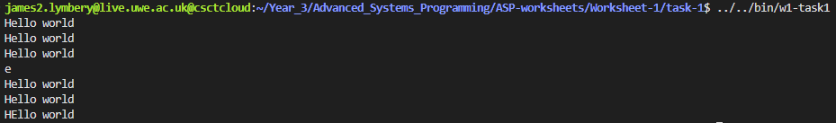
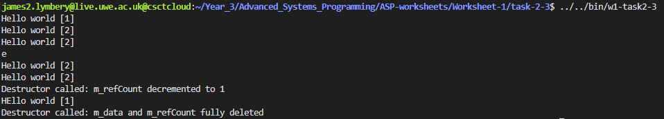
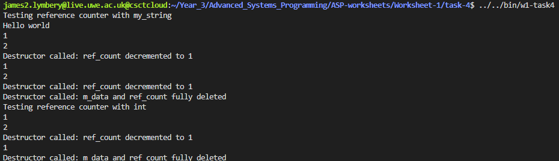

# Worksheet 1

This README is dedicated to worksheet 1 only, and will detail each of the four tasks.

## Task 1

For Task 1 I implemented my own string class utilising the interface provided. I initially set out to write it without using standard functions, but was assured that using standard functions is perfectly fine, so switched to simpler implementations - for example using `strlen()` & `strcpy()`.

I ended up adding a few extra private variables to the class, namely `m_data` to store the string and `m_size` to store the length of the string. However, I chose to remove `m_size` as I believe the minor computation for `strlen()` is worth removing the chance of storing stale data. It is important to note that during initialisation I ensure to set the character array size to `strlen(input + 1)` to ensure that `strcpy(m_data, input)` can store the null terminator at the end of the string, as `strlen()` does not include the null terminator in it's length calculation. This is shown below:

```c++
my_string::my_string(const char* input){
    m_data = new char[strlen(input) + 1];
    strcpy(m_data, input);
}
```

Two important parts of my implementation are ensuring that the overloaded `=` operator and the copy constructor both utilise shallow copies by address, rather than copying to a new place in memory, shown below:

```c++
// Copy constructor - using another my_string by reference, not a deep copy
my_string::my_string(my_string const& s){
    m_data = s.m_data;
};

// Assignment operator - by reference, not a deep copy
my_string& my_string::operator= (my_string const& s){
    if (this != &s){
        m_data = s.m_data;
    }
    return *this;
};
```

Both of these functions utilise the adress of the string to copy, so that it is directly set to the same point in memory. This means changing one string also changes the other. The assignment operator will also just return a reference to the current string object (if the strings are the same). This functionality in action is shown below (from the provided test file).



## Task 2-3

In order to add reference counting to the class I added one new private variable to the class, `m_refCount`. This variable would be used to track the current number of references to the string. In initialisation I made sure to initialise `m_refCount` in memory and set it to 1, shown below:

```c++
// Constructor with string input
my_string::my_string(const char* input){
    // Include + 1 to ensure strcpy has enough space to include the null terminator
    m_data = new char[strlen(input) + 1];
    strcpy(m_data, input);
    m_refCount = new size_t(1);
}
```

In order to implement reference counting correctly the assignment and copy operators had to both be altered to include incrementing `m_refCount`, and the destructor had to be implemented to decrement `m_refCount` when a reference goes out of scope. If `m_refCount` reached 0 then `m_data` and `m_refCount` both get freed from memory entirely.

```c++
// Copy constructor - using another my_string by reference, not a deep copy
my_string::my_string(my_string const& s){
    m_data = s.m_data;
    m_refCount = s.m_refCount;
    (*m_refCount)++;
};

// Assignment operator - by reference, not a deep copy
my_string& my_string::operator= (my_string const& s){
    if (this != &s){
        m_data = s.m_data;
        m_refCount = s.m_refCount;
        (*m_refCount)++;
    }
    return *this;
};
```

Destructor implementation:

```c++
// Destructor, deletes the string data and the reference count
// (if it is the last reference) or just decrements the reference counter
my_string::~my_string(){
    (*m_refCount)--;
    if (*m_refCount == 0){
        delete []m_data;
        delete m_refCount;
        std::cout << "Destructor called: m_data and m_refCount fully deleted" << std::endl;
    } else {
        std::cout << "Destructor called: m_refCount decremented to " << *m_refCount << std::endl;
    }
}
```

In order to prove the reference counter implementation was working as expected, I also altered the print function to print out the current reference count:

```c++
void my_string::print() const{
    std::cout << m_data << " [" << *m_refCount << "]" << std::endl;
};
```

When ran through the test suite it worked as expected, giving the following result - with a few print statements relating to Task 3, that state when the reference counter is decremented and when the data is fully deleted:



## Task 4

First of all, I removed reference counting from the my_string class itself by removing `m_refCount` as a private variable, and all instances where it is handled (initialised, decremented, incremented) as this would now be handled by a separate template class `ref_counter`.

Due to how the compiler handles templates it is not possible to separate the interface of the class from the implementation for template classes. My custom implementation of the reference counter class is as follows:

```c++
template <typename T>
class ref_counter{
    public:
        // Default constructor, initialsie to nullptrs
        ref_counter(): m_refCount(nullptr), p_data(nullptr){};
        // Constructor with data, initialise ref_count to 1 and set p_data to data
        ref_counter(T* data): m_refCount(new size_t(1)), p_data(data){};
        // Destructor, decrement ref_count and delete data if ref_count is 0
        ~ref_counter(){
            (*m_refCount)--;
            if (*m_refCount == 0){
                delete p_data;
                delete m_refCount;
                std::cout << "Destructor called: m_data and ref_count fully deleted" << std::endl;
            } else {
                std::cout << "Destructor called: ref_count decremented to " << *m_refCount << std::endl;
            }
        }
        // Dereference operator, return data
        T& operator*(){
            if (p_data == nullptr){
                throw std::invalid_argument("Dereferencing nullptr");
            }
            return *p_data;
        }
        // Arrow operator, return data
        T* operator->(){
            if (p_data == nullptr){
                throw std::invalid_argument("Dereferencing nullptr");
            }
            return p_data;
        }
        // Assignment operator, copy data and increment ref_count (unless copying itself)
        ref_counter& operator=(ref_counter const& input){
            if (this != &input){
                p_data = input.p_data;
                m_refCount = input.m_refCount;
                (*m_refCount)++;
            }
            return *this;
        }
        // Copy constructor, copy data and increment ref_count
        ref_counter(ref_counter const& input){
            p_data = input.p_data;
            m_refCount = input.m_refCount;
            (*m_refCount)++;
        }
        //  Return the ref_count
        size_t returnRefCount(){
            return *m_refCount;
        }
    private:
        // Reference count and data
        size_t* m_refCount;
        T* p_data;
};
```

In my implementation `m_refCount` is now moved to this separate class, as well as a new private variable `p_data` which is a generic type, holding the same type the class is initialised with. The deference & arrow operator both return the underlying data, allowing access of the stored variable and the stored type's attached functions.

In order to test this new implementation I created the following test file (since one was not provided for Task 4):

```c++
int main(){
    {
        std::cout << "Testing reference counter with my_string" << std::endl;
        ref_counter<my_string> test(new my_string("Hello world"));
        test->print();
        std::cout << test.returnRefCount() << std::endl;
        {
            ref_counter<my_string> x = test;
            std::cout << test.returnRefCount() << std::endl;
        }
        std::cout << test.returnRefCount() << std::endl;
        ref_counter<my_string> copied_string = test;
        std::cout << test.returnRefCount() << std::endl;
    }
    {
        std::cout << "Testing reference counter with int" << std::endl;
        ref_counter<int> test(new int(5));
        std::cout << test.returnRefCount() << std::endl;
        {
            ref_counter<int> x = test;
            std::cout << x.returnRefCount() << std::endl;
        }
        std::cout << test.returnRefCount() << std::endl;
    }
}
```

As you can see, it is being tested with the custom my_string class, as well as with a built in type (integers). I created an extra method for the class, being `returnRefCount()` in order to better illustrate the status of the reference counter for testing. Output of the test file can be seen below:



The test file features multiple defined scopes, in order to show fully removing the data, and testing the reference counter with an int has been shown in order to display the classes ability to be used for any type. Due to the implementation of the arrow and dereference operator, the stored type's built in functions can be called - for example my_string can call the .print() function and "Hello world" is printed as expected above.
