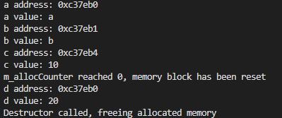
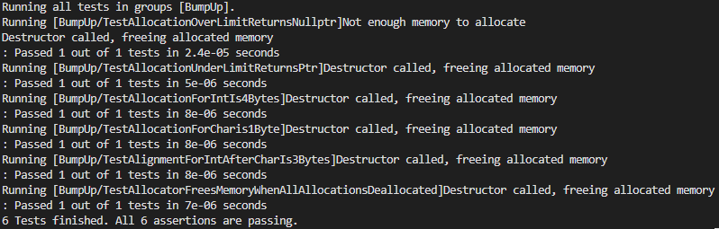

# Worksheet 2

This README is dedicated to Worksheet 2 only, and will detail each of the three tasks.

## Task 1

The goal of Task 1 was to implement a bump allocator and it's `alloc` and `dealloc` functionality. In order to implement a bump allocator I first started with designing the interface for the class.

The stored private variables are as follows:

```c++
private:
    char* m_start;
    char* m_next;
    size_t m_allocCounter;
    size_t m_size;
    size_t m_sizeAllocated;
```

- `m_next` and `m_start` are memory pointers, represented as `char*` types due to a char representing 1 byte in memory and pointer arithmetic being supported (unlike `void*`). These pointers are used to keep track of the start of memory and also where the next position to allocate objects is located.
- `m_allocCounter` is stored as a `size_t` (due to being an unsigned integer type) and stores the number of times something has been allocated to the bump allocator.
- `m_size` and `m_sizeAllocated` are also of type `size_t`, as `size_t` allows storage of the largest possible object the system can handle (if such an instance is necessary).

The public methods for the bump allocator are as follows (and will be explored below):

```c++
public:
    bump_allocator(size_t size);
    template <typename T>
    T* alloc(T numObjects);
    size_t getAllocCounter();
    void dealloc();
    ~bump_allocator();
```

To initialise the bump allocator we take in a size value, which will be used to initialise the size of the memory block in bytes - this size value is used to define the `m_start` char array of `size`, and the `m_next` pointer is initially set to the same value as `m_start`. `m_allocCounter` and `m_sizeAllocated` are both initialised to 0.

```c++
bump_allocator::bump_allocator(size_t size)
    : m_size(size), m_allocCounter(0), m_sizeAllocated(0) {
    // Allocate memory for the bump allocator and set to the start of the memory block
    m_start = new char[size];
    // set the next pointer to the start pointer
    m_next = m_start;
}
```

As for allocating objects onto the bump allocator, it requires allocating a number of objects (`numObjects`) - for example 1 int or 1 char. The number of bytes required to store said type are then calculated based on the `sizeof(T) * numObjects` (with `sizeof(T)` returning the number of bytes to store one variable of said object).

The address must also be aligned, and is done so using `curAdr + (alignof(T) -1) & ~(alignof(T) -1)` which rounds up to the nearest multiple of the alignment and clears the lower bits, which ensures the address is aligned to the requirement of type `T`. The `alignmentOffset` is then calculated by minusing the aligned address from the original address (to be used for later calculations).

After the address is aligned I check if there is enough space left in the bump allocator to allocate the required bytes. If there isn't then return a `nullptr`, otherwise increase the value of `m_sizeAllocated` accordingly, as well as increment the `m_allocCounter` and set the `m_next` pointer to the next free space on the allocator (`alignmentOffet + sizeBytes`). Then return the aligned address (`alignedAdr`) to point to where the allocated object is (just after alignment).

```c++
        template <typename T>
        T* alloc(T numObjects){
            // Get the current address of the memory block
            size_t curAdr = reinterpret_cast<size_t>(m_next);

            // Allocate memory for the object based on size of T and the number of objects
            size_t sizeBytes = sizeof(T) * numObjects;

            // Calculate the alignment offset & clear the lower bits, rounding up to the nearest multiple of the alignment
            size_t alignedAdr = curAdr + (alignof(T) - 1) & ~(alignof(T) - 1);
            size_t alignmentOffset = alignedAdr - curAdr;

            // Check if there is enough memory to allocate after alignment
            if (sizeBytes + alignmentOffset + m_sizeAllocated > m_size) {
                std::cout << "Not enough memory to allocate" << std::endl;
                return nullptr;
            }

            m_sizeAllocated += sizeBytes + alignmentOffset;
            m_allocCounter++;
            m_next += alignmentOffset + sizeBytes;

            // Return the aligned address before sizeBytes is added (points to start of newly allocated memory after alignment)
            return reinterpret_cast<T*>(alignedAdr);
        }
```

Deallocating objects from the bump allocator can only be done when the `m_allocCounter` is equal to zero, so when dealloc is called it simply decrements `m_allocCounter`, unless the counter reaches zero which leads to the `m_next` pointer being reset to `m_start` and the allocated memory zeroed out.

```c++
void bump_allocator::dealloc(){
    --m_allocCounter;
    if (m_allocCounter == 0){
        // Reset the next pointer to the start of the memory block
        m_next -= m_sizeAllocated;
        // Set the memory from the start pointer to the size allocated to 0
        std::memset(reinterpret_cast<void*>(m_start), 0, m_sizeAllocated);
    }
}
```

`delete()` only gets called during the destructor, as the deallocate function only resets the memory - it may still be reused. `m_start` is set to `nullptr`, ensuring the pointer no longer points to deallocated memory.

```c++
bump_allocator::~bump_allocator(){
    std::cout << "Destructor called, freeing allocated memory" << std::endl;
    delete(m_start);
    m_start = nullptr;
}
```

The test file `filetest_bump.cpp` can be found in the `task-1` folder inside `Worksheet-2`. This file provides the below output, and demonstrates all the above functionality.



## Task 2

The goal of Task 2 was to develop unit tests utilising the simpletest library for the bump up allocator implementation.

I implemented six unit tests, and created a test fixture, which gave me a baseline for the majority of the tests (same setup and memory allocation) unless a test required a different memory allocation. This also helped ensure my tests were consistent. I also utilised simpletest's group functionality, so all the tests were defined on the `BumpUp` group. This feature would be very useful in cases where you are testing multiple different types of objects and wish to have pass rates for each individual group.

```c++
class BumpUpFixture: public TestFixture{
    public:
        void Setup() override {
            m_bumpAllocator = std::make_unique<bump_allocator>(1024);
        }

        void TearDown() override {
            size_t allocCount = m_bumpAllocator->getAllocCounter();
            while (allocCount > 0){
                m_bumpAllocator->dealloc();
                allocCount--;
            };

            // Reset the bump allocator to nullptr to free memory
            m_bumpAllocator.reset(nullptr);
        }

    std::unique_ptr<bump_allocator> m_bumpAllocator;
};
```

As for the tests themselves:

The first test is the only test of the group that doesn't utilise the fixture, as it was easier to define an allocator with only 1 byte of memory, and attempt to allocate two chars in order to prove that the allocation should be rejected due to a lack of memory and return `nullptr`.

```c++
DEFINE_TEST_G(TestAllocationOverLimitReturnsNullptr, BumpUp){
    bump_allocator bump(1);

    char* a = bump.alloc<char>(2);
    TEST_MESSAGE(a == nullptr, "Allocation should be a nullptr due to being over memory limit!");
}
```

My second test checks whether an allocation under the maximum size limit provides a pointer, rather than a nullptr, by checking if a `nullptr` is NOT returned (since a `char*` pointer will always be returned if a `nullptr` is not).

```c++
DEFINE_TEST_GF(TestAllocationUnderLimitReturnsPtr, BumpUp, BumpUpFixture){
    char* a = m_bumpAllocator->alloc<char>(1);
    TEST_MESSAGE(a != nullptr, "Allocation should not be a nullptr due to memory being available!");
}
```

My third test checks whether the allocation for an integer is 4 bytes of memory by comparing the difference between two allocated integer addresses.

```c++
DEFINE_TEST_GF(TestAllocationForIntIs4Bytes, BumpUp, BumpUpFixture){
    int* a = m_bumpAllocator->alloc<int>(1);
    int* b = m_bumpAllocator->alloc<int>(1);

    TEST_MESSAGE((reinterpret_cast<char*>(b) - reinterpret_cast<char*>(a)) == sizeof(int), "Difference between the memory addresses should be 4 bytes for int!");
}
```

My fourth test checks whether the allocation for a char is 1 byte of memory by comparing the difference between two allocated char addresses.

```c++
DEFINE_TEST_GF(TestAllocationForCharis1Byte, BumpUp, BumpUpFixture){
    char* a = m_bumpAllocator->alloc<char>(1);
    char* b = m_bumpAllocator->alloc<char>(1);

    TEST_MESSAGE((reinterpret_cast<char*>(b) - reinterpret_cast<char*>(a)) == sizeof(char), "Difference between the memory addresses should be 1 byte for char!");
}
```

My fifth test checks whether alignment is working as expected by checking whether the difference between a char address and an integer address is 7 (when the integer is assigned after). This difference of 7 should exist due to the 3 bytes required to align to a multiple of 4 (the size of an int) and another 4 bytes to hold the integer itself.

```c++
DEFINE_TEST_GF(TestAlignmentForIntAfterCharIs3Bytes, BumpUp, BumpUpFixture){
    char* a = m_bumpAllocator->alloc<char>(1);
    int* b = m_bumpAllocator->alloc<int>(1);
    char* c = m_bumpAllocator->alloc<char>(1);

    TEST_MESSAGE((int(c - a) -1) == 7, "Alignment should be equal to 3 bytes if assigning an integer after a char!");
}
```

My final test makes multiple allocations to the bump allocator, then deallocates them all, and then allocates a new variable. This is done to check whether the memory address is the same as the first allocated variable - as the bump allocator's pointer should get reset back to the beginning when all variables all deallocated.

```c++
DEFINE_TEST_GF(TestAllocatorFreesMemoryWhenAllAllocationsDeallocated, BumpUp, BumpUpFixture){
    int* a = m_bumpAllocator->alloc<int>(1);
    int* b = m_bumpAllocator->alloc<int>(1);
    int* c = m_bumpAllocator->alloc<int>(1);

    m_bumpAllocator->dealloc();
    m_bumpAllocator->dealloc();
    m_bumpAllocator->dealloc();

    int* d = m_bumpAllocator->alloc<int>(1);

    TEST_MESSAGE(a == d, "Memory should be allocated at the same address after deallocating all memory!");
}
```

Below is output to prove that all six tests passed as expected.



## Task 3

The goal of task 3 was to implement a bump down version of the allocator, and also implement a benchmark `<template>` function so that the sped of the bump up allocator and bump down allocator can be compared.

### Bump Down Allocator

In order to implement the bump down allocator, it was mostly the same (if not slightly simpler), To begin with, I removed `m_sizeAllocated`, as it will no longer be necessary for my bump down implementation due to not being required for checking available size. The rest of the class interface is identical, but the implementation does differ.

First of all, in the constructor `m_next` is now set to the end of the assigned memory block, rather than the start.

```c++
bump_down_allocator::bump_down_allocator(size_t size)
    : m_size(size), m_allocCounter(0) {
    // Allocate memory for the bump allocator and set to the start of the memory block
    m_start = new char[size];

    // set the next pointer to the end of the memory block
    m_next = m_start + (size - 1);
}
```

As for allocation, there are a few differences. The first comes in the form of alignment, where it is a simpler calculation to round down to the nearest multiple of alignment. The checking for available memory is different (since we're bumping down) and we also decrement the `m_next` pointer with the size of bytes to allocate (`sizeBytes`) & aligned bytes (`curAdr - alignedAdr`).

Instead of returning the address before the bytes are added like in a bump up allocator we return the address after the object bytes AND alignment bytes are added. This is due to the fact that it leads to the pointer pointing to the first allocated byte for the object, since it's decrementing rather than incrementing.

```c++
template <typename T>
T* alloc(T numObjects){
    // Get the current address of the memory block
    size_t curAdr = reinterpret_cast<size_t>(m_next);

    // Allocate memory for the object based on sizeof T and the number of objects
    size_t sizeBytes = sizeof(T) * numObjects;

    // Calculate alignment offset by rounding down to the nearest multiple of the alignment
    size_t alignedAdr = curAdr & ~(alignof(T) - 1);

    // Check if there is enough memory to allocate after alignment
    if ((alignedAdr - sizeBytes) < reinterpret_cast<size_t>(m_start)) {
        std::cout << "Not enough memory to allocate" << std::endl;
        return nullptr;
    }

    m_allocCounter++;
    m_next -= sizeBytes + (curAdr - alignedAdr);

    // Return the current address of the memory block
    return reinterpret_cast<T*>(m_next);
}
```

Deallocation remains almost identical, with the only difference being how the `m_next` pointer is reset when `m_allocCounter` reaches zero, which is by being set back to the end of the allocated memory.

```c++
void bump_down_allocator::dealloc(){
    --m_allocCounter;
    if (m_allocCounter == 0){
        // Reset the next pointer to the start of the memory block
        m_next = m_start + (m_size - 1);
        // Set the memory from the start pointer to the size allocated to 0
        std::memset(reinterpret_cast<void*>(m_start), 0, (m_size-1));
    }
}
```

### Benchmarking

My benchmark template function takes in any function, and any number of args. I also included `iterations` as an argument to allow for a passed in benchmark to be looped over (for averages, or other purposes).

```c++
template <typename Func, typename... Args>
double benchmark(Func& func, uint iterations,  Args&&... args) {
    auto start = std::chrono::high_resolution_clock::now();

    for (int i = 0; i < iterations; i++){
        func(std::forward<Args>(args)...);
    }

    auto end = std::chrono::high_resolution_clock::now();
    std::chrono::duration<double, std::milli> duration = end - start;
    return duration.count()/iterations;
}
```

An example of how this benchmark function was used:

```c++
// Function to allocate memory for char and int types, with the number of iterations and number of objects to allocate size for
void allocate_test_down(bump_down_allocator* bump_alloc, int iterations, int size){
    for (int i = 0; i < iterations; i++){
        bump_alloc->alloc<char>(size);
        bump_alloc->alloc<int>(size);
    }
};

// 10 benchmark iterations, with 10000 sizeof(T * 1) allocations per benchmark iteration
double down_timeTaken = benchmark(*allocate_test_down, 10, &bump_down, 10000, 1);
```

I utilised the benchmark function with void functions found in the `filetest_benchmark.cpp` file (one example above). This can be viewed in the `task-3` subfolder of `Worksheet-2`. The tabled results were resulting from compiling with no optimisation flags.

| Benchmark                      | Bump Up      | Bump Down    |
| ------------------------------ | ------------ | ------------ |
| 10,000 Small-sized Allocations | 0.112525 ms  | 0.0974384 ms |
| 5,000 Medium-sized Allocations | 0.0563795 ms | 0.0460241 ms |
| 2,500 Large-sized Allocations  | 0.0312786 ms | 0.0230351 ms |

- Small-sized - 10,000 allocations of one char followed by one integer.
- Medium-sized - 5,000 allocations of 50 chars followed by 50 integers.
- Large-sized - 2,500 allocations of 100 chars followed by 100 integers.

I also ran the same benchmarks with the `-O2` and `-O3` compiler flags, and due to the optimisations of the compiler the differences between bump down & bump up were essentially removed - and either traded blows on all three benchmarks.

To conclude, bump down is faster on average (keep in mind each test was averaged over 10 runs), unless an optimisation flag is used to make up the difference.
